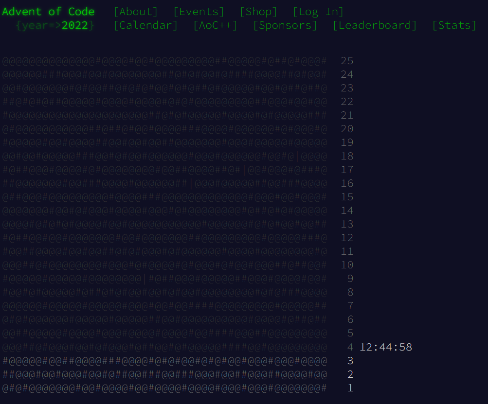

# Advent of Code 2022

## Table of Contents

- [Introduction](#introduction)
- [Table of Contents of the puzzles](#table-of-contents-of-the-puzzles)
- [Rights](#rights)

## Introduction

This is a repository for my solutions to the [Advent of Code 2022](https://adventofcode.com/2022) puzzles.



I'm using this as an opportunity to use every language I can think of to solve the puzzles. I'm also using this as an opportunity to learn more about the languages I'm using.

I'm also using this as an opportunity to learn [Unit Testing](https://en.wikipedia.org/wiki/Unit_testing) and [Test Driven Development](https://en.wikipedia.org/wiki/Test-driven_development) (TDD).

_My main goal here is just to follow regular training and practice and developping something else than applications (Bot, Website, Software, etc..)._

## Table of Contents of the puzzles

- [Day 1: Calorie Counting](https://adventofcode.com/2022/day/1)

  Made with [Python](https://www.python.org/)

  [GitDir](https://github.com/Eric-Philippe/Calendrier-IT/tree/master/Day1)

  ***

- [Day 2: Rock Paper Scissors](https://adventofcode.com/2022/day/2)

  Made with [NodeJs](https://nodejs.org/en/) & [Mocha](https://mochajs.org/)

  [GitDir](https://github.com/Eric-Philippe/Calendrier-IT/tree/master/Day2)

  ***

- [Day 3: Rucksack Reorganization](https://adventofcode.com/2022/day/3)

  Made with [Java](https://www.java.com/en/) & [JUnit5](https://junit.org/junit5/)

  [GitDir](https://github.com/Eric-Philippe/Calendrier-IT/tree/master/Day3)

  ***

- [Day 4: Camp Cleanup](https://adventofcode.com/2022/day/4)

  Made with [C#](https://docs.microsoft.com/en-us/dotnet/csharp/) & [NUnit](https://nunit.org/)

  [GitDir](https://github.com/Eric-Philippe/Calendrier-IT/tree/master/Day4)

### Clear Commands

```bash
# Bash Command is available with the file "clear.sh"
# You can use it with the command "sh clear.sh"
```

```cmd
:: CMD Command is available with the file "clear.cmd"
:: You can use it with the command ".\clear.cmd"
```

## Credits

All rights are reserved by the creators of the [Advent of Code](https://adventofcode.com/2022) puzzles. The statements for the puzzles are copied from the Advent of Code website.
